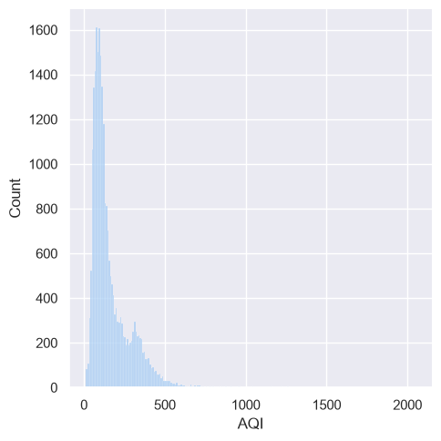
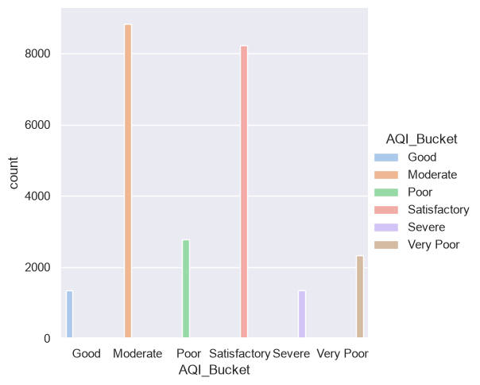
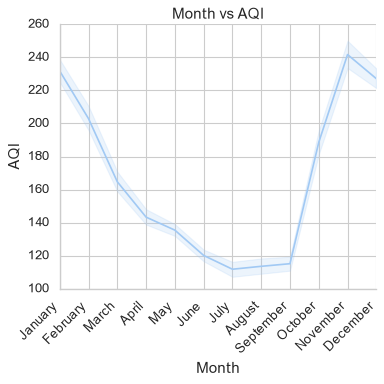
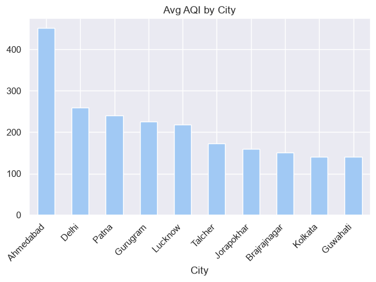
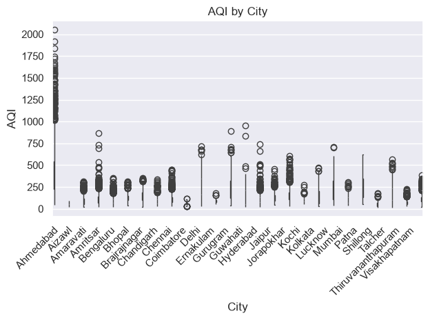
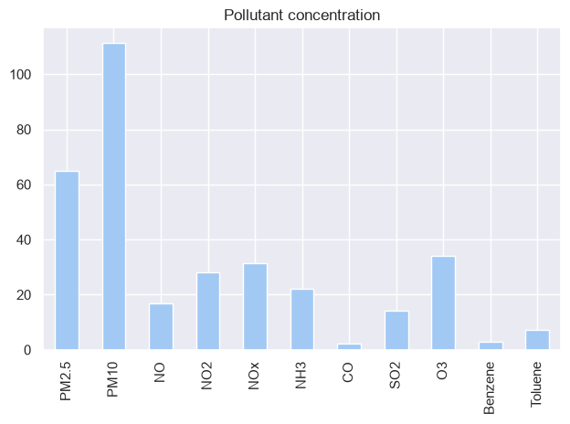
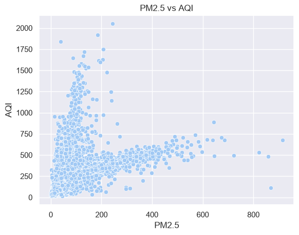
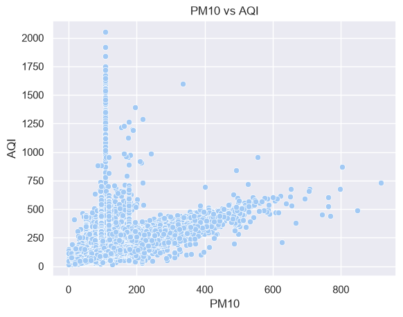
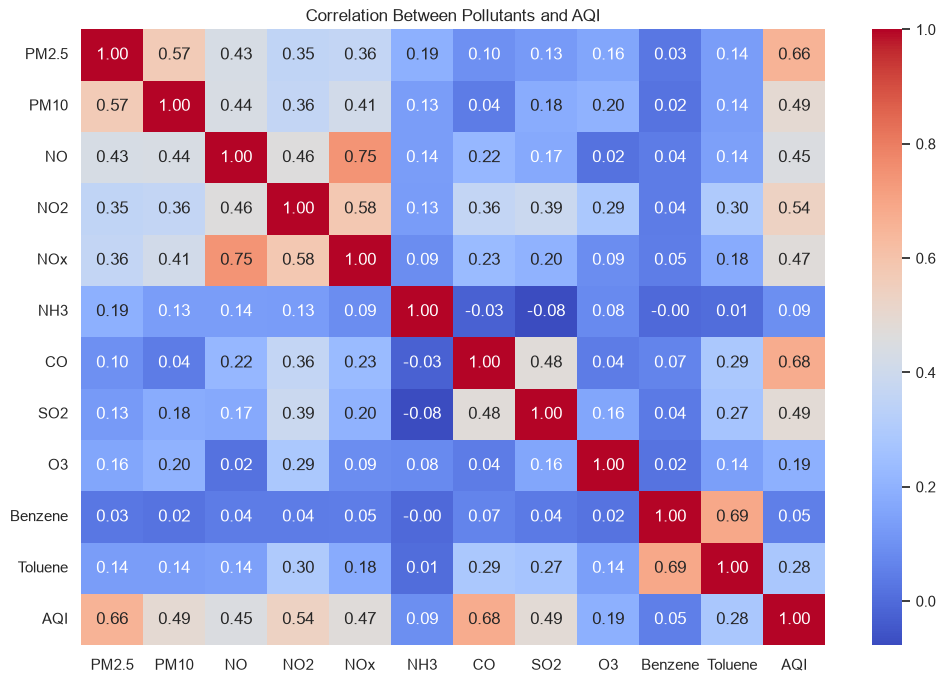

# India Air Quality Index (AQI) Analysis

A comprehensive **Data Wrangling** and **Exploratory Data Analysis(EDA)** project on AQI dataset using **Pandas**, **Numpy**, **Matplotlib** and **Seaborn**.

The Objective of this project is to clean raw air quality data, assess its quality, handle missing values, perform eda, and find out meaningful insights about air pollution trends across India.

---

## Project Objectives:

- Assess data quality and identify issues.
- Perform data cleaning and preprocessing.
- Handle missing values and inconsistent data.
- Analyze AQI trends across Indian cities.
- Explore relationships between pollutants.
- Generate meaningful visualizations.
- Summarize insights for better understanding of air pollution patterns.

---

## Dataset:

Dataset used for now:
- **city_data.csv**

The dataset contains daily air quality observations collected from multiple Indian cities.

### Columns:
- `City`: Different cities across India.
- `Date`: Date data is recorded on.
- `PM2.5`: Particulate matter(small dust particles) 2.5mm radius
- `PM10`: Particulate matter , 10mm radius
- `NO`: Nitrogen Oxide
- `NO₂`: Nitrogen Dioxide
- `NOx`: Nitrogen oxides
- `NH₃`: Nitrogen trihalide
- `CO`: Carbon Dioxide
- `SO₂`: Sulphur Dioxide
- `O₃`: Ozone
- `Benzene`: Reactive chemical substance
- `Toluene`: Reactive chemical substance
- `Xylene`: Reactive chemical substance
- `AQI`: Air Quality Index (air quality measurement unit)
- `AQI Bucket`: It groups a range of aqi into a simple color or health warnings.

---

## Tech Stack:
The following tech stacks have used for data wrangling and EDA:
- Python
- Pandas
- Numpy
- Matplotlib
- Seaborn
- Jupyter Notebook

---

### Data Wrangling:
The following preprocessing steps were performed:

- Dataset assessment
- Duplicate value checking
- Missing value analysis
- Handling missing values
- Date conversion
- Data type correction
- Feature inspection
- Data validation

---

### Exploratory Data Analysis

The project answers questions such as:

#### Dataset Overview

- Number of observations
- Number of cities
- Date range
- Missing value summary

#### City-wise Analysis

- Which cities have the highest AQI?
- Which cities have the cleanest air?
- Average AQI by city

#### Pollutant Analysis

- Distribution of pollutants
- Most dominant pollutants
- Correlation between pollutants

#### Time Analysis

- AQI trend over time
- Monthly AQI trends
- Yearly AQI trends

#### Correlation Analysis

- Correlation heatmap
- Relationship between AQI and pollutants

---

#### Visualizations:

The notebook contains:

- Count Plots
- Histograms
- Box Plots
- Scatter Plots
- Line Charts
- Correlation Heatmap
- Distribution Plots

---

### Images:
images/
│
├── 
├── 
├── 
├── 
├── 
├── 
├── 
├── 
├── 

---

### Author:
*Shiven Sharma*